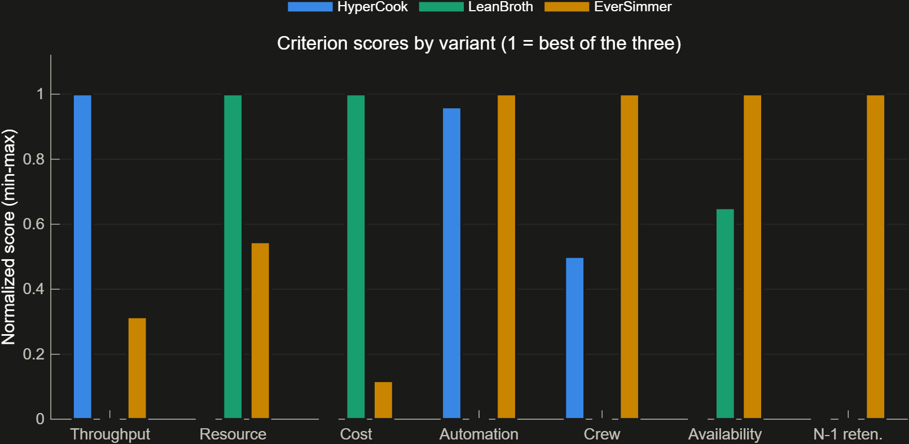

# 06 — Trade Study Results

Methodology: [`05_trade_study_methodology.md`](05_trade_study_methodology.md). Source data: [`../analysis/results/variantMetrics.csv`](../analysis/results/variantMetrics.csv), [`../analysis/results/tradeScores.csv`](../analysis/results/tradeScores.csv), [`../analysis/results/mcWinShare.csv`](../analysis/results/mcWinShare.csv), produced by [`../analysis/pipeline/runVariantAnalysis.m`](../analysis/pipeline/runVariantAnalysis.m) and [`../analysis/pipeline/runTradeStudy.m`](../analysis/pipeline/runTradeStudy.m). Variant design concepts are described in [`04_physical_variants.md`](04_physical_variants.md).

The trade study has been run. This document reports the current canonical three-candidate comparison. ADR-035 leaves the baseline decision open; the scores below are evidence for review, not a committed selection.

Live pipeline note: the figures under `docs/figures` now track the full-comparison rerun over all three variants. If the formal gate narrows the candidate set, the compliant-only decision rerun is published separately under `../analysis/results/*_compliant.*` and `figures/compliant/` so these comparison figures are not overwritten.

## 1. Rolled-up metrics and budget utilization

| Metric | HyperCook (A) | LeanBroth (B) | EverSimmer (C) | SR cap |
|---|---|---|---|---|
| Mass, kg (utilization) | 14,917.5 (99.5%) | 7,967.5 (53.1%) | 11,555.0 (77.0%) | ≤15,000 (SR-GS-011) |
| Power, kW (utilization) | 500.4 (100.1%) | 240.6 (48.1%) | 364.2 (72.8%) | ≤500 (SR-GS-012) |
| Cost, kCr (utilization) | 2,097.2 (104.9%) | 1,148.0 (57.4%) | 1,985.4 (99.3%) | ≤2,000 (SR-GS-013) |
| Volume, m³ (utilization) | 418.2 (104.6%) | 254.1 (63.5%) | 313.1 (78.3%) | ≤400 (SR-GS-014) |
| Simulated throughput, bph (margin) | 308.4 (+54.2%) | 196.8 (−1.6%) | 231.9 (+15.9%) | ≥200 (SR-GS-002) |
| Automation, avg | 0.955 | 0.838 | 0.960 | ≥0.8 (SR-GS-003) |
| Operators | 3.8 | 4.9 | 2.7 | ≤5 (SR-GS-004) |
| Availability | 0.9557 | 0.9696 | 0.9772 | — (informative) |
| N-1 capacity retention | 0% | 0% | 67.3% | — (informative) |
| Leaf component count | 25 | 20 | 28 | — |

**HyperCook: 500.4 kW, 2097.2 kCr, 418.2 m^3.** It exceeds the power, cost, and volume caps and has only 0.5% mass margin. EverSimmer retains just 0.7% cost margin. LeanBroth is the only candidate with comfortable margin across all four resource budgets.

## 2. Compliance gates

**20/24 checks pass.** EverSimmer clears all eight gates, HyperCook fails three resource gates, and LeanBroth fails the behavioral throughput gate. The canonical trade artifacts still score all three candidates so that each candidate's strengths and failures remain visible.

| Gate | SR | HyperCook | LeanBroth | EverSimmer |
|---|---|---|---|---|
| Mass ≤ 15,000 kg | SR-GS-011 | PASS | PASS | PASS |
| Power ≤ 500 kW | SR-GS-012 | **FAIL** | PASS | PASS |
| Cost ≤ 2,000 kCr | SR-GS-013 | **FAIL** | PASS | PASS |
| Volume ≤ 400 m³ | SR-GS-014 | **FAIL** | PASS | PASS |
| Throughput ≥ 200 bph | SR-GS-002 | PASS | **FAIL** | PASS |
| Automation ≥ 0.8 | SR-GS-003 | PASS | PASS | PASS |
| Operators ≤ 5 | SR-GS-004 | PASS | PASS | PASS |
| Gravity ≥ 12 g | SR-GS-015/016 | PASS | PASS | PASS |
| **All 8 gates** | | **FAIL** | **FAIL** | **PASS** |

## 3. Criteria scores

Min-max normalized scores (see [`05_trade_study_methodology.md`](05_trade_study_methodology.md) §3) show a consistent pattern: EverSimmer leads on Automation, Availability, and N-1 Retention (it is the only variant with any single-fault throughput retention at all — the other two both retain 0% after their worst-case single-unit loss); LeanBroth leads on ResourceMargin and CostMargin by a wide margin; HyperCook leads only on ThroughputMargin, and even there its lead over EverSimmer is modest (+60% vs. +20% margin) given EverSimmer's parallel-cell topology also produces real throughput headroom.

## 4. Scenario scores

| Scenario | HyperCook (A) | LeanBroth (B) | EverSimmer (C) | Winner |
|---|---|---|---|---|
| Balanced | 0.346 | 0.347 | 0.685 | EverSimmer |
| ThroughputFirst | 0.471 | 0.297 | 0.605 | EverSimmer |
| CostLean | 0.198 | 0.615 | 0.532 | LeanBroth |
| MissionAssurance | 0.246 | 0.312 | 0.820 | EverSimmer |

EverSimmer wins three of the four named scenarios, including **ThroughputFirst** — a scenario weighted 35% toward raw throughput margin, where HyperCook was expected to dominate. HyperCook's razor-thin margins on every *other* criterion (cost, resources, automation headroom, N-1 retention) drag its weighted score down even under throughput-weighted scoring, so its throughput edge alone is not enough to win. LeanBroth wins only under **CostLean**, the one scenario that weights cost and resource margin most heavily (0.55 combined) — consistent with it being purpose-built as the resource-budget-optimized variant.

## 5. Monte Carlo weight sensitivity

Across 5,000 random Dirichlet weight draws (`rng(42)`, see methodology §3), the win shares are:

| Variant | Win share |
|---|---|
| HyperCook (A) | 4.6% |
| LeanBroth (B) | 9.9% |
| EverSimmer (C) | 85.5% |

EverSimmer wins 85.5% of random weightings spanning the full space of plausible stakeholder priorities — not just the four hand-picked scenarios above — indicating the result is not an artifact of scenario selection.

## 6. Per-variant findings

**HyperCook (A).** Delivers the highest simulated throughput (308.4 bph) but fails power, cost, and volume at 500.4 kW, 2,097.2 kCr, and 418.2 m³. Its single-string topology also gives it effectively 0% N-1 throughput retention. It loses even the ThroughputFirst scenario to EverSimmer because those resource and resilience penalties outweigh the raw-rate lead.

**LeanBroth (B).** The clear resource-budget leader and lowest-cost candidate at 1,148.0 kCr. Its simulated 196.8 bph misses the 200 bph floor, however. It wins CostLean and 9.9% of the Monte Carlo draws, making it a meaningful descope option only if the throughput finding is fixed or the requirement changes.

**EverSimmer (C).** Wins 3 of 4 named scenarios and 85.5% of random weightings. Its triplicated-cell topology is the only one with graceful degradation (67.3% retention), and it leads on automation and availability. Its principal resource risk is cost: 1,985.4 kCr leaves only 14.6 kCr of margin.

## 7. Caveats

1. **EverSimmer's cost margin is only 0.7%.** At 1,985.4 of 2,000 kCr, a modest vendor or scope change can create a new non-compliance.
2. **EverSimmer's degraded mode is a contingency, not nominal compliance.** Its 67.3% retention demonstrates graceful degradation for SR-GS-026, but the resulting rate remains below the SR-GS-002 nominal floor.
3. **LeanBroth is inexpensive but non-compliant.** Its CostLean win must be read alongside the 196.8 bph throughput finding.
4. **HyperCook already exceeds three resource caps.** Detailed design needs a concrete recovery plan, not merely additional margin management.

## 8. Selection status

**No baseline is committed under ADR-035.**

EverSimmer currently leads the evidence: it wins 3 of 4 stakeholder scenarios and 85.5% of 5,000 Monte Carlo draws, is the only variant with graceful single-fault degradation, and is the only candidate that clears all eight quantitative gates. That makes it the strongest candidate, not an adopted baseline.

The next selection review should carry three follow-up actions:

1. **Create cost margin for EverSimmer** before any selection, because only 14.6 kCr remains.
2. **Define EverSimmer degraded-mode operations** as a below-nominal contingency state.
3. **Retain explicit recovery paths for the alternatives:** LeanBroth needs throughput improvement; HyperCook needs power, cost, and volume reductions.
