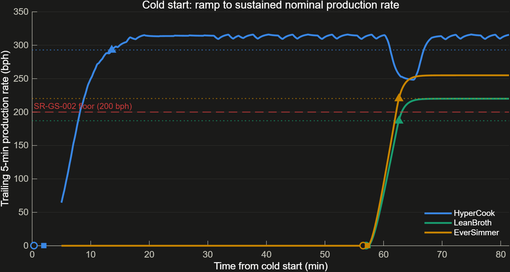
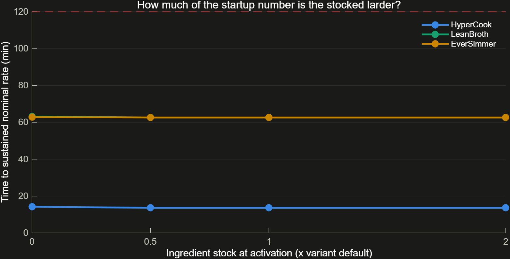
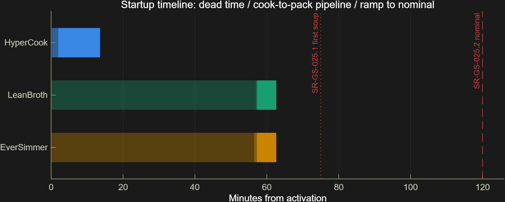

# 20 — Startup Transient: First Soup and Time to Nominal Rate

Branch exploration: SR-GS-025 asks the plant to reach nominal operating throughput within a defined startup period, and the project answered it with a number that measured something else — the first packaged bowl — against a cap that existed only inside the test generator. This branch separates the two questions the requirement actually asks, gives the requirement real numbers, and measures both from the same cold-start run. Two findings came out: essentially all of the batch variants' startup is the first cook cycle rather than anything downstream of it, and the supervisor's plant mode — then called `Nominal` — was entered up to 56 minutes before the plant had produced anything at all, because it is a flow-and-health state rather than a rate one. The second was fixed by renaming it `Running` (ADR-043).

Artifacts: [`../analysis/utils/gsStartupMetrics.m`](../analysis/utils/gsStartupMetrics.m), [`../analysis/sweeps/runStartupStudy.m`](../analysis/sweeps/runStartupStudy.m). Decisions: ADR-040, ADR-041, ADR-042, ADR-043 in [`07_decision_log.md`](07_decision_log.md).

## 1. What was actually being measured

Before this branch, `runBehavioralAnalysis` reported one startup number, `TimeToFirstOut_s`: the time until packaged flow first appears at the root `OutboundShipments` port. The system tests verified SR-GS-025 by checking that number against 3600 s — a literal in [`../tests/system/buildSystemTestFile.m`](../tests/system/buildSystemTestFile.m), because the requirement text contained no number for `gsParseBudgetValue` to read. Every other quantitative cap in this project is parsed out of its requirement; this one was not connected to the requirement at all.

The metric was also answering the wrong question. "Reach nominal operating throughput" is not "produce one bowl":

| | first packaged bowl | sustained nominal rate |
|---|---|---|
| HyperCook | 119 s | 817 s |

For a continuous-line variant the gap is a factor of seven. Reporting only the first number would have let a design review conclude HyperCook commissions in two minutes.

## 2. Three metrics, one extractor

[`gsStartupMetrics.m`](../analysis/utils/gsStartupMetrics.m) takes one cold-start run and returns:

| Metric | Definition |
|---|---|
| `TimeToFirstSoup_s` | cooked soup first exists at the **cook-stage output**, upstream of QC and packaging |
| `TimeToFirstOut_s` | first **packaged** bowl at the root port |
| `TimeToNominal_s` | trailing 5-minute production rate first reaches ≥95% of steady state **and holds it for 10 minutes** |
| `TimeToModeRunning_s` | when the supervisor enters `Running` — all lines healthy and material flowing |
| `StartupEnergy_kWh` | energy consumed before the plant reaches nominal |

Two definitional choices matter.

**Nominal is a dwell band, not a first crossing.** The band must be held continuously for 10 minutes, and a window that would run past the end of the record does not qualify — so a too-short run reports `NaN` rather than a flattering number.

Worth stating plainly: **on these three designs the dwell changes nothing.** First crossing and dwell both give 817 / 3757 / 3758 s. The trailing 5-minute window already absorbs the batch drain spikes that would have made an instantaneous-flow test fire early, so the guard never has to bite. It is kept anyway — it is what makes "reach *and hold*" mean what it says, and a longer batch cycle or a coarser rate window could produce a design that crosses the band without holding it.

**Rate is a trailing integral difference**, not instantaneous flow — the quantity an operator reads off a shift counter. That is what makes the metric meaningful for a batch plant whose instantaneous output is a train of spikes.

The same function is called by `runBehavioralAnalysis`, `runStartupStudy`, and the `StartupReadiness` test criteria, so the three cannot report different startup times for the same run.

**Instrumentation.** Cook-stage soup flow was not logged anywhere. HyperCook and LeanBroth each merge cooked flows at a `SoupSum` block inside their QC component, so both log a single `soupFlow_bps` there. EverSimmer has no plant-wide merge point at all — its three cells stay independent until packaging — so it logs `soupFlow_Cell1..3` and the consumer sums them.

## 3. Results at nominal stock

*Trailing 5-minute production rate from cold. Circles mark first soup, squares first packaged output, triangles sustained nominal; dotted lines are each variant's −5% settle band.*

| Variant | First soup | First packaged | Sustained nominal | Supervisor enters `Running` | Startup energy |
|---|---|---|---|---|---|
| HyperCook | 17 s (0.3 min) | 119 s (2.0 min) | **817 s (13.6 min)** | 2 s | 99.5 kWh |
| LeanBroth | 3421 s (57.0 min) | 3441 s (57.3 min) | **3757 s (62.6 min)** | 2 s | 163.6 kWh |
| EverSimmer | 3390 s (56.5 min) | 3436 s (57.3 min) | **3758 s (62.6 min)** | 2 s | 287.5 kWh |

All three meet both clauses of the amended requirement (75 min / 120 min, §5).

**"Sustained" means the first sustained window, not a rate that never dips again.** After settling, the trailing rate falls back below its own −5% band 7.5% of the time on HyperCook, 19.8% on LeanBroth, and 25.6% on EverSimmer — the hourly QC calibration outage is the visible HyperCook dip just after the 60-minute mark in the figure above, and the batch variants ride their vat cycle troughs. `TimeToNominal_s` is the first instant a full 10-minute window sits inside the band, which is the right answer to "when is the plant up," but it should not be read as a promise that output never leaves the band afterwards. Steady-state throughput (`SimThroughput_bph`, averaged over hours) is the metric that accounts for those excursions, and it already does.

### Finding 1 — the batch variants' startup is entirely the first cook cycle

The gap between first soup and first packaged output is the QC-and-packaging pipeline. It is **20 seconds** for LeanBroth and **46 seconds** for EverSimmer, against 57 minutes of getting the first batch cooked. HyperCook is the opposite shape: 17 seconds to soup, then 102 seconds of pipeline.

That has a direct design consequence. For the batch variants, buffering, parallelising, or speeding up anything downstream of the vats buys nothing at startup — the levers are upstream and inside the vat: prep must accumulate a full charge before the first fill can even begin, and then fill, heat, and simmer run to completion before a drop of soup exists. A hot start, a deliberately undersized first batch, or staggering the cells so the first one starts filling early are the changes that would move the number. This is invisible in a packaged-output metric, which measures the far end of both effects at once.

### Finding 2 — the plant mode was named for a promise it does not make

The supervisor's second mode was called `Nominal`. Read next to SR-GS-025 ("reach nominal operating throughput"), that is a readiness signal. It never was one. The transition into it is `[outFlow > 0.001]` — any material flowing at all — and its siblings `Degraded` and `Halted` are keyed on `sum(health > 0.5)`. The mode axis is availability, not production rate.

The gap that misreading would have cost:

| Variant | Enters the mode | Actually at nominal rate | Lead |
|---|---|---|---|
| HyperCook | 2 s | 817 s | 13.6 min early |
| LeanBroth | 2 s | 3757 s | 62.6 min early |
| EverSimmer | 2 s | 3758 s | **62.6 min early** |

All three enter it within 2 seconds of activation - EverSimmer 56 minutes before any soup exists at all.

**Fixed by renaming, not by re-timing (ADR-043).** The state is now `Running`, which states its actual predicate — all lines healthy and material flowing — and sits honestly beside `Degraded` and `Halted` on the ladder it belongs to. Transition conditions, numeric codes, and every mode-based assertion are untouched: the supervisor was never wrong, its label was. `gsStartupMetrics` reports `TimeToModeRunning_s`, and `tStartup/runningModeIsNotRateReadiness` pins the lead so the two quantities cannot quietly converge in a reader's head again.

What remains true is that **no signal in the plant reports rate readiness**. Time to nominal rate has to be measured from the output, which is what this branch added; there is no telemetry shortcut, and adding one would be a supervisory-control design change rather than a measurement one.

## 4. Sensitivity to stock at activation

The startup numbers in §3 are measured from a plant whose ingredient stores already hold stock at `t = 0` — 1500 / 600 / 900 bowls for HyperCook / LeanBroth / EverSimmer. That is a defensible reading of "activation" (a commissioned factory has a larder) but it was an *unstated* assumption sitting underneath a reported number, which is the kind of thing that survives a design review unchallenged. [`runStartupStudy.m`](../analysis/sweeps/runStartupStudy.m) sweeps it rather than arguing about it (ADR-042).

*Time to sustained nominal rate against stock at activation. The lines are flat.*

| Stock at activation | HyperCook first soup / nominal | LeanBroth first soup / nominal | EverSimmer first soup / nominal |
|---|---|---|---|
| 0× (empty larder) | 0.65 / 14.2 min | 57.6 / 63.2 min | 56.7 / 62.9 min |
| 0.5× | 0.28 / 13.6 min | 57.0 / 62.6 min | 56.5 / 62.6 min |
| 1× (nominal) | 0.28 / 13.6 min | 57.0 / 62.6 min | 56.5 / 62.6 min |
| 2× | 0.28 / 13.6 min | 57.0 / 62.6 min | 56.5 / 62.6 min |

**The assumption does not flatter the numbers.** Starting from a completely empty larder costs 36 seconds on HyperCook, 32 seconds on LeanBroth, and 14 seconds on EverSimmer — under a minute in every case, with no difference at all between half stock and double stock. All twelve points meet both requirement clauses.

The honest form of that claim is the absolute one, not a proportional one. As a fraction of startup the empty-larder cost is 0.9% for LeanBroth and 0.4% for EverSimmer but **4.4% for HyperCook** — which says more about HyperCook's startup being 13.6 minutes rather than an hour than it does about the larder.

The reason is that resupply flows from `t = 0` at 330 / 215 / 245 bph, which already exceeds what the prep stage can draw. The stores are therefore never the binding constraint during startup: prep is fed at its own rate whether the larder is full or empty, and the startup clock is set by prep accumulating a full vat charge and then by the fill-heat-simmer cycle. An empty larder would matter to *endurance* (SR-GS-021, [`18_storage_endurance.md`](18_storage_endurance.md)), not to startup.

This is worth recording precisely because it is a negative result. The concern was legitimate — an unstated initial condition was propping up a reported metric — and the cheap way to close it was to measure it rather than to reason about it.

*Where the startup time goes at nominal stock: dead time to first soup (pale), cook-to-pack pipeline (mid), ramp to sustained nominal (solid).*

## 5. The requirement

SR-GS-025 asks for startup readiness, and it decomposes into two separately-verifiable clauses (ADR-041):

| Id | Clause | Cap |
|---|---|---|
| SR-GS-025.1 | First soup produced at the cook-stage output | 75 min from activation |
| SR-GS-025.2 | Nominal production rate reached and sustained | 120 min from activation |

Both descriptions lead with their numeric cap, because `gsParseBudgetValue` returns the first number in the text. The caps are deliberately generous: the question this branch was asked to answer is how long startup takes, not which variant fails a startup gate. The parent now also records the measurement precondition — activation of a commissioned plant with its stores at nominal stock (§4).

The amendment is a committed, idempotent script rather than a hand-edit in the Requirements Editor, so the change is reproducible and reviewable.

## 6. Verification

A dedicated `StartupReadiness` suite in `GalacticSoupSystemTests.mldatx`, one case per variant, criteria calling `gsStartupMetrics` with caps parsed from the requirement:

| Case | Model | Criteria | Verify links |
|---|---|---|---|
| HyperCook startup | `PhysicalHyperCook` | first soup ≤ 75 min AND nominal ≤ 120 min | SR-GS-025.1, SR-GS-025.2 |
| LeanBroth startup | `PhysicalLeanBroth` | first soup ≤ 75 min AND nominal ≤ 120 min | SR-GS-025.1, SR-GS-025.2 |
| EverSimmer startup | `PhysicalEverSimmer` | first soup ≤ 75 min AND nominal ≤ 120 min | SR-GS-025.1, SR-GS-025.2 |

**LeanBroth carries startup evidence for the first time.** Its nominal case remains an unlinked regression baseline because it genuinely fails the SR-GS-002 throughput floor, but startup readiness is a separate question that it genuinely satisfies — and per ADR-035 each candidate's evidence stands on its own terms rather than being suppressed because the variant fails elsewhere.

The old SR-GS-025 links on the HyperCook and EverSimmer *nominal* cases are removed: those cases now verify the throughput floor and serving temperature only, which is what their criteria actually check.

## 7. Gotchas

- **`interp1` rejects duplicate sample points, and a variable-step solver produces them.** Zero crossings — and batch drains produce many — emit repeated time values. Any metric that resamples onto a uniform grid has to deduplicate first; keeping the *last* sample at each instant is the right choice, since that is the post-event value a rate calculation should see.
- **MATLAB's TeX interpreter has no `\square`.** `\circ` and `\Delta` render; `\square` throws "String scalar or character vector must have valid interpreter syntax" and the title silently renders wrong. Spelling marker names out in words is more legible in a figure legend anyway.
- **`gsParseBudgetValue` returns the first number in the requirement description**, so a requirement whose text mentions any other quantity before its cap will parse the wrong value. Requirement text that is meant to be machine-read has to be written cap-first — a constraint on prose that is easy to violate in a later edit and produces no error when violated.
- **Child requirements count toward coverage denominators.** SR-GS-025's two clauses make the requirement set 30 rather than 28, so every `N/28` in a coverage summary has to agree. Any test asserting on those totals is part of the same change as a requirement-set edit.
