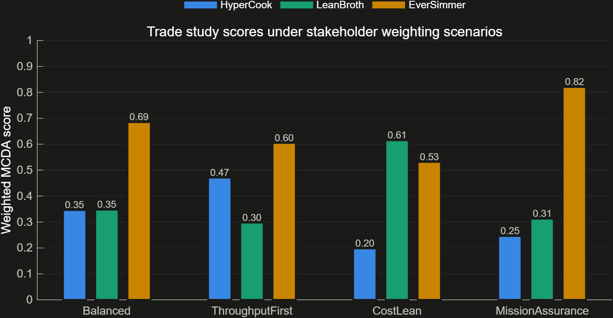
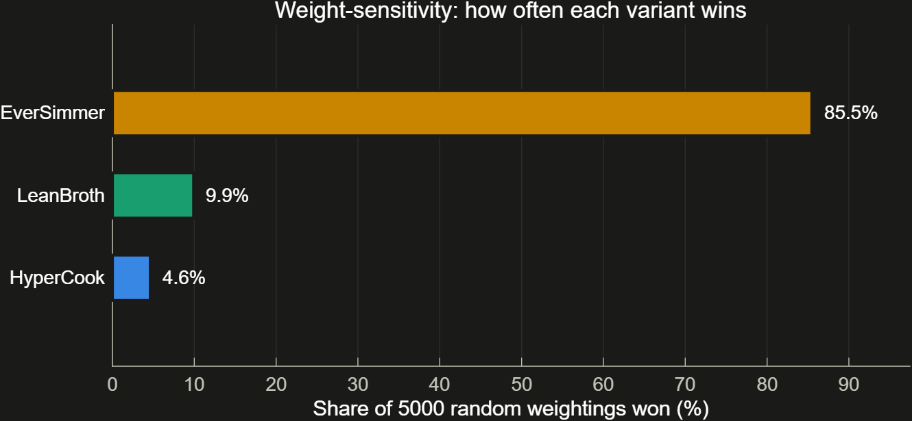

# Pick a Winner You Can Defend

**The question this answers:** Weighing everything at once, which architecture comes out ahead — and does that answer survive someone else's priorities?

## How it works

- Seven criteria matter here — throughput headroom, resource headroom (mass/power/volume), cost headroom, automation, crew headroom, availability, and fault retention (card 03's number). Each variant is scored 0 to 1 on each one, best gets a 1, worst gets a 0.
- Four named stakeholder viewpoints are scored separately — Balanced, ThroughputFirst, CostLean, MissionAssurance — because how much a criterion matters is a matter of opinion, and different stakeholders have different opinions.
- To check whether the answer depends on picking the "right" stakeholder, the analysis also draws 5,000 random weightings and asks: who wins across the whole range of plausible ways of caring about these seven things? The randomness is seeded, so anyone can rerun it and get the identical 5,000 draws.
- All three variants are scored side by side, including the two that failed the gate in card 04. Their gate failures travel with them rather than removing them from the table, so each candidate can be read on its own terms — a score here is not a clean bill of health.

## What we found

| Scenario | HyperCook | LeanBroth | EverSimmer | Winner |
|---|---|---|---|---|
| Balanced | 0.34 | 0.35 | 0.68 | EverSimmer |
| ThroughputFirst | 0.47 | 0.30 | 0.60 | EverSimmer |
| CostLean | 0.20 | 0.61 | 0.52 | LeanBroth |
| MissionAssurance | 0.24 | 0.31 | 0.82 | EverSimmer |

EverSimmer wins three of the four named scenarios, and wins **85.2%** of the 5,000 random weightings — against LeanBroth's 10.3% and HyperCook's 4.5%.

LeanBroth takes CostLean, and that result is exactly why the gate matters: it is the cheapest way to make soup right up until you notice it does not make enough soup to meet the requirement. Its win is a descope option to weigh against a known failure, not a recommendation.

## Why it matters

Winning a few hand-picked scenarios could just mean the committee happened to ask the right questions. Winning 85.2% of 5,000 random ones means EverSimmer is the answer under most plausible ways of caring about these seven criteria — that is the difference between "the committee liked it" and "it holds up under scrutiny." It is also not a rubber stamp: EverSimmer loses CostLean outright, so a team that genuinely weights cost above everything else is being told something real.

Note that this scoring does not by itself select a baseline. ADR-035 reopened that decision, and no variant is committed as baseline in the artifacts.

Full detail: [05_trade_study_methodology.md](../05_trade_study_methodology.md), [06_trade_study_results.md](../06_trade_study_results.md), [10_behavioral_trade_update.md](../10_behavioral_trade_update.md)
