# Variant Design Space — 24 Unmodeled Alternatives

Figures: the PNGs in this folder, generated by [`makeVariantSpaceSchematics.m`](../../../analysis/reporting/makeVariantSpaceSchematics.m).

The trade study compares three physical variants (see [`04_physical_variants.md`](../../04_physical_variants.md)). Those three are a small sample of a much larger design space. The 24 concepts below are **sketches only**: none is modeled, rolled up, gated or simulated, and none has any numbers attached. They are here to make one point: whichever variant the trade study picks, it is picked from the set that was modeled, not from every design that could have been.

The sketches use the same visual language as the baseline schematics. Material flows left to right, stacked boxes are parallel units, gray marks shared or single-string infrastructure, and a dashed box is a standby unit. Each sketch takes the color of the baseline it is closest to in intent: blue for HyperCook (throughput), aqua for LeanBroth (budget), yellow for EverSimmer (resilience).

## Throughput-leaning

### 1. MegaLadle
HyperCook scaled up to 6 cook lines, with QC and packaging doubled so the back end is no longer single-string. It goes even further over the budget caps.

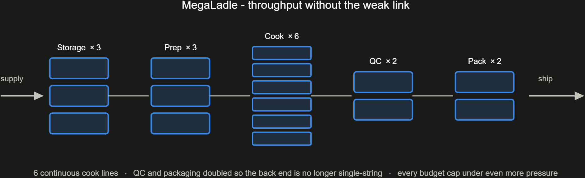

### 2. FlashBoil
Eight small high-pressure cookers with minute-long cycles instead of a few large lines. Losing any one unit costs little capacity, but pressure vessels add mass and safety cost.

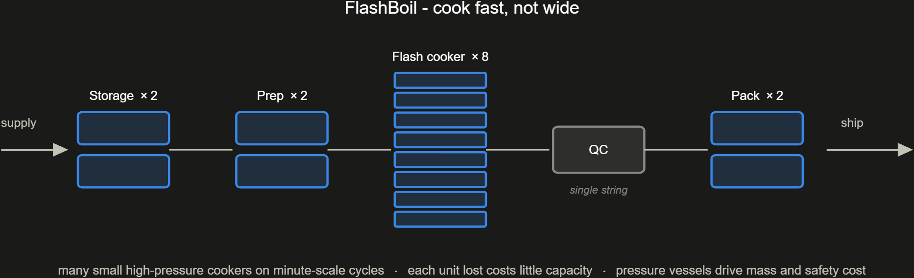

### 3. SoupStream
A single continuous, high-capacity cook tower with one of every other stage. It has the simplest control problem of any variant, and every stage is a single point of failure.

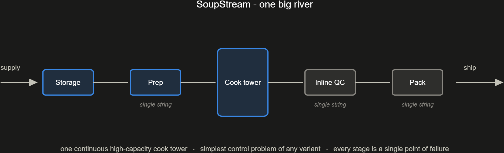

### 4. BufferLine
HyperCook with surge tanks between stages, so a short stoppage upstream doesn't starve the cook lines. The tanks add mass and volume but no output.

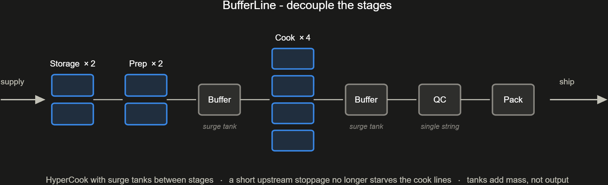

### 5. ConcentrateCo
Cooks a concentrated base and adds water at packaging, so cooking capacity no longer scales with bowl count. Water becomes a supply item.

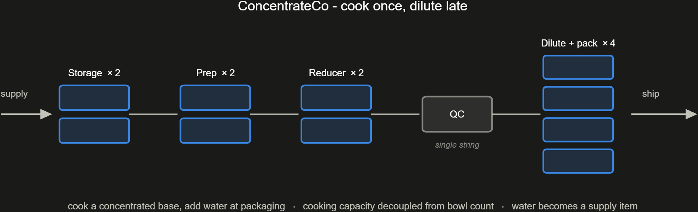

### 6. TwinTrack
Two high-rate independent lines. It costs less than EverSimmer's three cells, but losing a line halves output instead of leaving two-thirds.

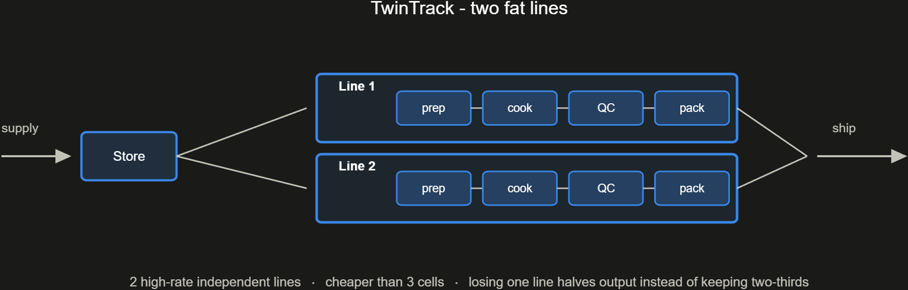

### 7. BatchFlex
Continuous lines carry the base load while batch kettles run specials and absorb peaks. The price is two cook technologies to maintain.

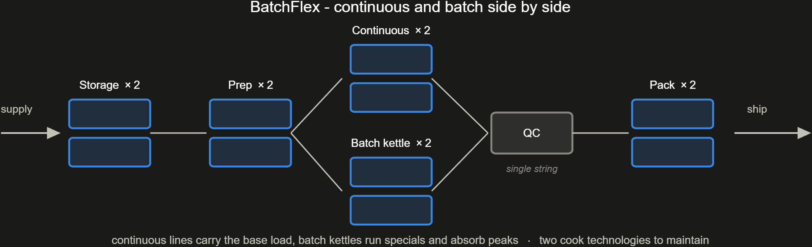

### 8. PadPush
Modest production with an oversized launch field, so rockets never wait for a pad. It optimizes turnaround rather than bowls per hour.

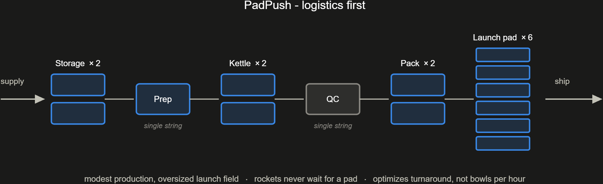

## Budget-leaning

### 9. OnePot
One large batch kettle and one of everything else: the smallest plant that makes soup at all. It has no fault tolerance and no headroom.

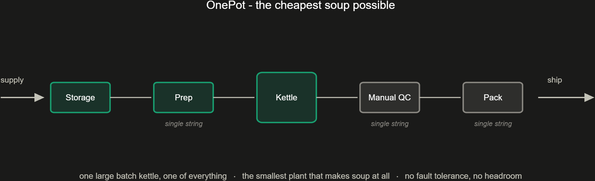

### 10. Crockworks
Twelve small, low-power slow cookers. Cook times are long and power draw is tiny, and the plant degrades gracefully almost by accident.

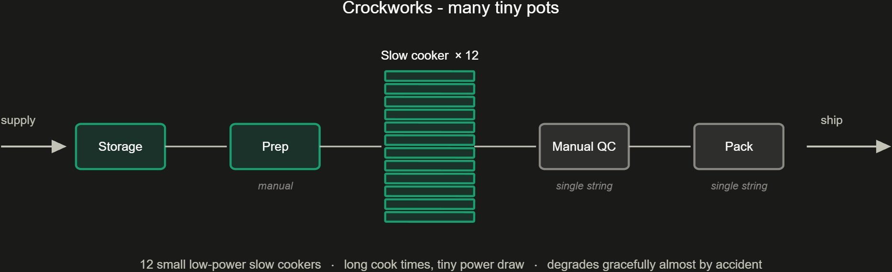

### 11. KitSoup
Ships dried soup kits and leaves the cooking to the customer, so the plant has no cook step. It may not meet the stakeholder need for ready-to-eat soup.

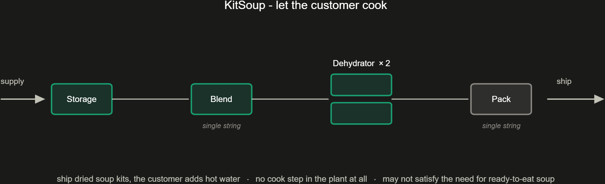

### 12. GalleyShip
Packs raw ingredient kits that are cooked aboard the rockets on the way. The plant gets smaller and every rocket gets heavier.

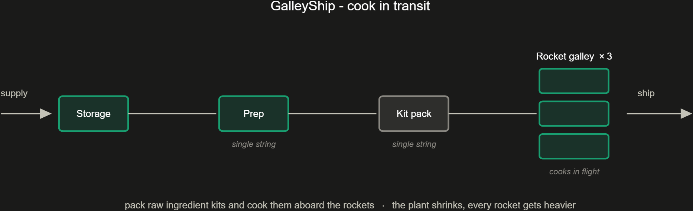

### 13. SolarSimmer
Solar-thermal kettles replace the reactor, which nearly frees up the power budget. Output follows the orbit, and nothing cooks in eclipse.

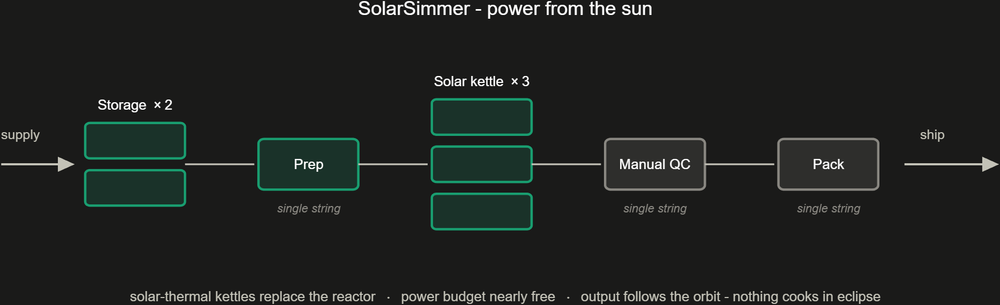

### 14. NightPot
Cooks only during off-peak power windows, keeps the soup hot in insulated tanks, and packs around the clock. Peak power drops, but hot-hold quality becomes a new risk.

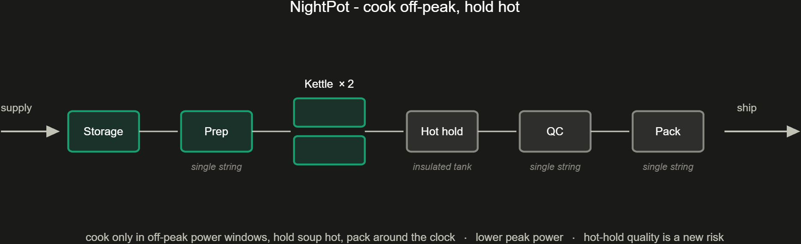

### 15. CameraQC
LeanBroth with the manual inspectors replaced by camera QC. It closes the automation gap and does nothing for throughput.

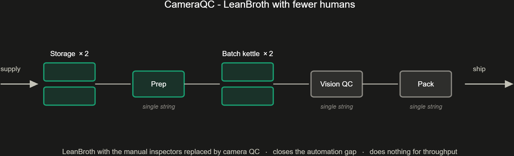

### 16. MultiCook
Combined prep-and-cook appliances, which means one machine type and one spares kit. Each unit is a compromise at both jobs.

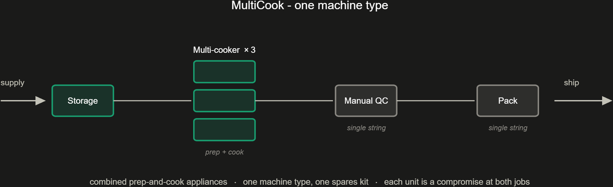

## Resilience-leaning

### 17. QuadSimmer
Four independent cells, each sized so that any three still meet the throughput floor. That gives N+1 redundancy instead of graceful degradation, at the cost of a fourth copy of everything.

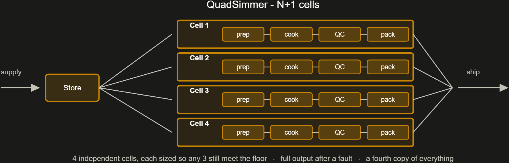

### 18. HotSpare
Parallel cook lines with one line kept warm on standby, plus doubled QC and packaging. Output stays full after a fault, and the spare is idle capital the rest of the time.

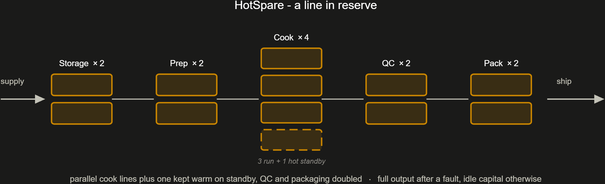

### 19. CrossStrap
Two strings of every stage, cross-connected at each hand-off, so any single unit can fail without losing a path. Routing and control get complicated.

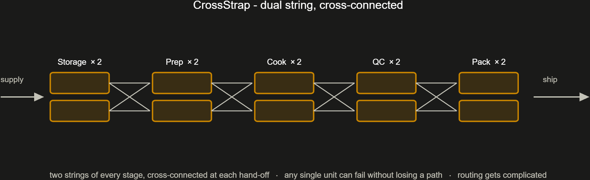

### 20. HubSpoke
Shared prep and packaging hubs feed three independent cook-and-QC cells. It is cheaper than EverSimmer, and the hubs become the new single points of failure.

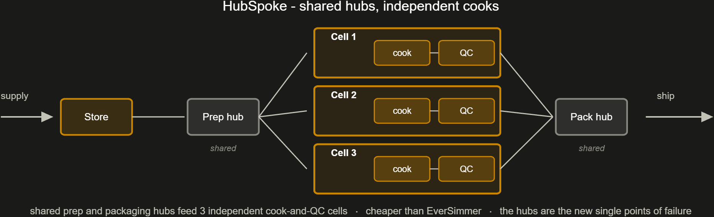

### 21. PodSwarm
Ten containerized mini-plants. Losing one leaves 90% of capacity, and failed pods are swapped by rocket rather than repaired on site.

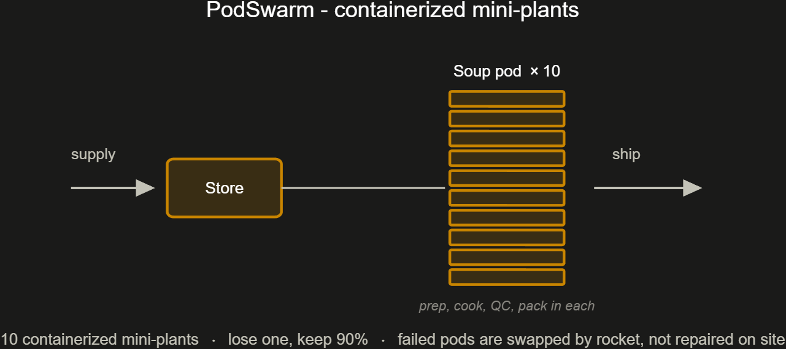

### 22. SplitSite
Two complete plants on different moons. It survives the loss of a whole site and pays every fixed cost twice.

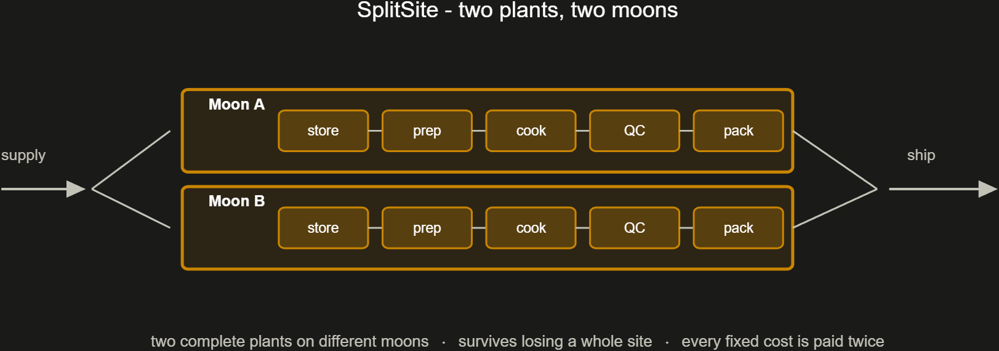

### 23. DarkFactory
EverSimmer's three cells run with zero operators and are tended by maintenance robots. The reliability question moves to the robot crew.

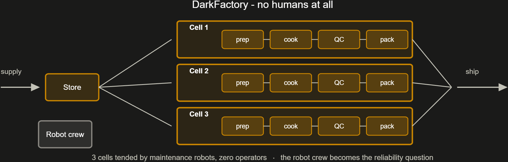

### 24. RecipeLines
One prep-and-cook cell per recipe family, with shared QC and packaging. Recipes can't cross-contaminate, but capacity sits idle when demand is lopsided.

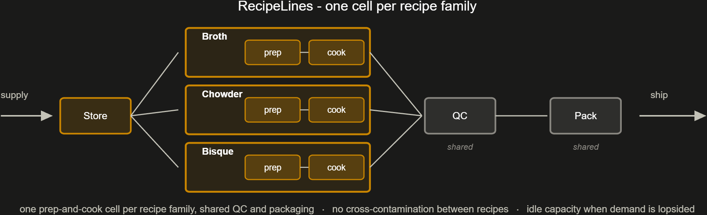
